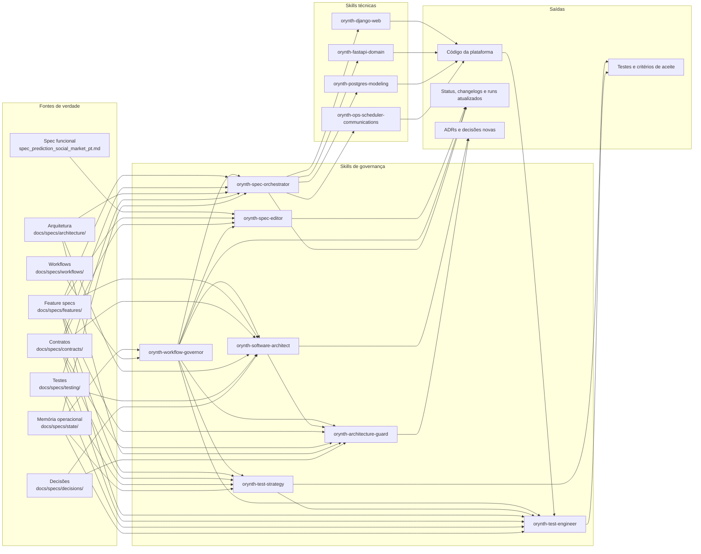
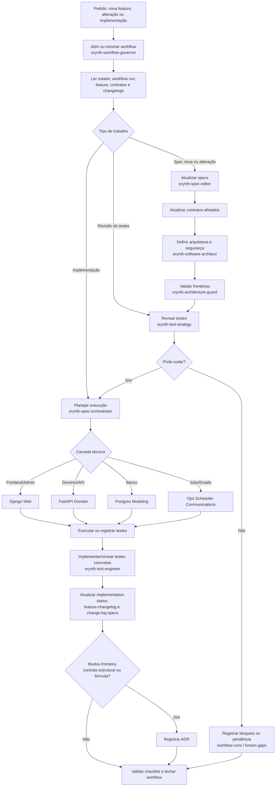

# Guia Rápido: Workflow de IA com Specs

## Objetivo

Este guia mostra como usar as specs e as skills do Orynth Trends para evoluir o projeto sem perder memória, sem misturar camadas e sem refazer áreas não impactadas.

## Ordem de trabalho

1. Abrir ou atualizar um workflow em `docs/specs/state/workflow-runs.md` quando a mudança tocar mais de um documento.
2. Ler a spec funcional em [../specs/spec_prediction_social_market_pt.md](../specs/spec_prediction_social_market_pt.md).
3. Ler a feature em `docs/specs/features/`.
4. Revisar contratos em `docs/specs/contracts/`.
5. Passar por arquitetura/segurança com `orynth-software-architect` quando a mudança for relevante.
6. Validar fronteiras em `docs/specs/architecture/`.
7. Revisar testes esperados em `docs/specs/testing/`.
8. Implementar ou revisar testes concretos quando houver código.
9. Só então fechar implementação ou workflow.
10. Ao terminar, atualizar `docs/specs/state/`, changelogs e, se necessário, `docs/specs/decisions/`.

## Quando usar cada skill

Índice completo: [../../tools/skills/orynth/README.md](../../tools/skills/orynth/README.md).

- `orynth-workflow-governor`: abrir, acompanhar, retomar, bloquear, concluir, cancelar ou substituir workflows multi-documento
- `orynth-spec-editor`: criar, traduzir, refinar ou alterar specs
- `orynth-spec-orchestrator`: conduzir implementação a partir das specs
- `orynth-software-architect`: definir arquitetura, segurança, estrutura de módulos e decisões técnicas relevantes
- `orynth-architecture-guard`: validar separação entre camadas
- `orynth-test-strategy`: definir critérios de aceite, regressão e cobertura
- `orynth-test-engineer`: implementar, revisar e executar testes concretos de backend, frontend, contratos e fluxos
- `orynth-django-web`: implementar frontend server-rendered, HTMX, Alpine.js, i18n de interface e admin Django
- `orynth-fastapi-domain`: implementar domínio, autenticação, endpoints e regras centrais em FastAPI/Python
- `orynth-postgres-modeling`: desenhar modelos relacionais, ledger, constraints, índices e rastreabilidade
- `orynth-ops-scheduler-communications`: implementar scheduler, jobs, eventos, comunicações e operação assíncrona

## Combinação recomendada de skills

- coordenação de processo multi-documento: `orynth-workflow-governor`
- mudança de documentação: `orynth-spec-editor`
- arquitetura e segurança propositiva: `orynth-software-architect`
- validação de fronteira: `orynth-architecture-guard`
- definição de aceite e regressão: `orynth-test-strategy`
- execução de testes concretos: `orynth-test-engineer`
- execução técnica:
  - UI e admin: `orynth-django-web`
  - domínio e API: `orynth-fastapi-domain`
  - persistência: `orynth-postgres-modeling`
  - automações e comunicações: `orynth-ops-scheduler-communications`
- coordenação geral da implementação: `orynth-spec-orchestrator`

## Mapa visual das skills



Leitura rápida:

- `orynth-workflow-governor` coordena processos longos e evita docs descasados.
- `orynth-spec-editor` muda a verdade documental.
- `orynth-software-architect` propõe arquitetura, segurança e estrutura antes de mudanças relevantes.
- `orynth-architecture-guard` protege fronteiras.
- `orynth-test-strategy` garante aceite, regressão e cobertura.
- `orynth-test-engineer` transforma a estratégia em testes executáveis e evidência.
- `orynth-spec-orchestrator` conduz a implementação usando as skills técnicas corretas.

## Fluxo visual de uma mudança



Regra de ouro: quando o trabalho cruzar mais de um documento, comece pelo workflow e termine no checklist.

## Processo com workflow

Use workflow quando a tarefa envolver qualquer combinação de feature spec, contrato, teste, estado, decisão ou código.

Passos mínimos:

1. escolher template em `docs/specs/workflows/`
2. criar ou atualizar entrada em `docs/specs/state/workflow-runs.md`
3. executar etapas do template
4. validar `docs/specs/state/workflow-checklists.md`
5. fechar como `concluido`, `bloqueado`, `cancelado` ou `substituido`

Reversão é lógica, não apagamento: registre novo workflow ou marque o workflow anterior como `cancelado` ou `substituido`.

## Arquitetura e segurança

Use `orynth-software-architect` antes de implementação quando houver nova feature, alteração de contrato, banco, ledger, autenticação, autorização, sessão, wallet, stake, resolução, reputação, ranking, eventos, scheduler, comunicações ou fronteiras entre camadas.

Saídas esperadas:

- desenho de solução por camada
- riscos de segurança, integridade e operação
- contratos ou ADRs necessários
- orientação para testes arquiteturais, integração e segurança

Depois disso, use `orynth-architecture-guard` para validar aderência às fronteiras decididas.

## Fluxo de testes

Toda feature deve ter testes pensados antes de ser considerada pronta.

Ordem recomendada:

1. revisar `docs/specs/testing/test-strategy.md`
2. confirmar critérios em `docs/specs/testing/acceptance-criteria.md`
3. declarar na feature os testes unitários, de integração e de fluxo esperados
4. mapear regressões por contrato e dependência direta
5. usar `orynth-test-engineer` para transformar a estratégia em testes executáveis quando houver código
6. atualizar `feature-changelog.md` quando testes mudarem por alteração de spec
7. registrar pendência em `known-gaps.md` se teste necessário não puder ser implementado agora

Uma implementação só deve ir para `validada` quando houver evidência de teste ou justificativa registrada.

## Como propor uma nova feature

1. Abrir workflow `new-feature`.
2. Criar nova spec em `docs/specs/features/` com frontmatter padrão.
3. Declarar contratos afetados e dependências.
4. Passar por `orynth-software-architect` para desenho técnico e segurança.
5. Definir testes esperados e critérios de aceite.
6. Atualizar `integration-map.md` e `implementation-status.md`.
7. Criar entrada inicial em `feature-changelog.md`.
8. Se criar contrato novo ou mudar fronteira, registrar uma decisão.
9. Validar checklist e fechar workflow.

## Como alterar feature existente sem refazer o resto

1. Abrir workflow `change-feature`.
2. Alterar a spec da feature afetada.
3. Atualizar somente os contratos listados como impactados.
4. Passar por `orynth-software-architect` quando houver impacto estrutural, segurança, dados, contrato ou domínio.
5. Revisar testes da feature e das dependências diretas.
6. Marcar implementações afetadas como `defasada_pela_spec` quando necessário.
7. Registrar a alteração em `feature-changelog.md`.
8. Não alterar áreas fora do mapa explícito de impacto.
9. Fechar workflow ou registrar bloqueio.

## Como marcar spec aprovada e implementação defasada

Exemplo:

- `status_spec: aprovada`
- `status_impl: defasada_pela_spec`

Use este estado quando a regra nova já foi aceita nos docs, mas o código ainda não acompanhou a mudança.

## Como registrar nova decisão técnica

Crie um novo arquivo em `docs/specs/decisions/` contendo:

- contexto
- decisão
- impacto
- alternativas rejeitadas
- data
- status

## Como retomar uma sessão usando apenas docs

Leia nesta ordem:

1. `docs/specs/state/workflow-runs.md`
2. `docs/specs/state/implementation-status.md`
3. `docs/specs/state/feature-changelog.md`
4. `docs/specs/state/change-log-specs.md`
5. a feature alvo
6. os contratos que ela lista
7. `integration-map.md`

## Exemplos rápidos

### Criar spec técnica da feature de carteira

Prompt sugerido:

```text
Use $orynth-workflow-governor e $orynth-spec-editor para abrir workflow new-feature e derivar a spec técnica de wallet a partir da spec funcional, preenchendo contratos, testes esperados, dependências, changelog e estado.
```

Complemento arquitetural:

```text
Use $orynth-software-architect para definir a arquitetura, riscos de segurança, módulos, dados, contratos e ADRs necessários para a feature FEAT-WALLET-001 antes da implementação.
```

### Alterar regra de stake sem afetar comentários

Passos:

1. editar `prediction-and-stake.md`
2. revisar `prediction-payloads.md` e `wallet-ledger.md`
3. marcar impactos em `implementation-status.md`
4. não tocar `comments.md` se não houver contrato compartilhado afetado

Prompt sugerido:

```text
Use $orynth-workflow-governor e $orynth-spec-editor para revisar a regra de stake da feature FEAT-PRED-001 com impacto controlado, atualizando contratos, testes, changelog e estado sem alterar features não dependentes.
```

Complemento técnico:

```text
Use $orynth-fastapi-domain e $orynth-postgres-modeling para detalhar a mudança de stake no domínio e no ledger, preservando os contratos atuais ou propondo ajuste explícito neles.
```

### Mudar estado de mercado e atualizar contratos/testes

Prompt sugerido:

```text
Use $orynth-workflow-governor, $orynth-architecture-guard e $orynth-test-strategy para revisar a introdução de um novo estado de mercado, atualizar contratos de ciclo de vida, testes e regressões esperadas.
```

### Retomar implementação de feature parcial

Prompt sugerido:

```text
Use $orynth-spec-orchestrator para retomar a implementação da feature FEAT-WALLET-001 a partir do estado atual, contratos dependentes e critérios de aceite.
```

Antes de codar, verificar se há workflow aberto:

```text
Use $orynth-workflow-governor para retomar o workflow aberto da feature FEAT-WALLET-001, identificar a próxima ação objetiva e validar pendências de testes.
```

Se a execução começar pelo backend:

```text
Use $orynth-fastapi-domain e $orynth-postgres-modeling para retomar a implementação da feature FEAT-WALLET-001 a partir da spec técnica, dos contratos do ledger e do status atual.
```

### Traduzir uma spec para `en` mantendo rastreabilidade

Prompt sugerido:

```text
Use $orynth-workflow-governor e $orynth-spec-editor para traduzir a spec da feature FEAT-MARKET-002 para en, preservando o vínculo com a origem funcional, registrando changelog e sem alterar contratos fora do escopo.
```

### Revisar testes antes de validar uma feature

Prompt sugerido:

```text
Use $orynth-workflow-governor e $orynth-test-strategy para abrir test-review-cycle da feature FEAT-PRED-001, mapear testes unitários, integração, fluxo e regressões por contrato, e atualizar feature-changelog.
```

Depois da estratégia:

```text
Use $orynth-test-engineer para implementar ou revisar testes concretos backend/frontend da feature FEAT-PRED-001, executar o que for aplicável e registrar evidência ou pendências no workflow.
```

### Implementar tela Django + HTMX a partir da spec

Prompt sugerido:

```text
Use $orynth-django-web para implementar a interface server-rendered da feature FEAT-MARKET-001 com HTMX, i18n e respeito estrito ao contrato de listagem de mercados.
```

Após implementar:

```text
Use $orynth-test-engineer para criar ou revisar testes de template, interação HTMX, i18n e regressão da feature FEAT-MARKET-001.
```

### Implementar endpoint e regra de domínio em FastAPI

Prompt sugerido:

```text
Use $orynth-fastapi-domain para implementar a mutação principal da feature FEAT-PRED-001 em FastAPI/Python, mantendo a lógica de domínio centralizada e alinhada aos contratos.
```

### Revisar modelagem de banco e ledger

Prompt sugerido:

```text
Use $orynth-postgres-modeling para propor a modelagem relacional da wallet e do ledger da feature FEAT-WALLET-001 com foco em integridade, auditabilidade e índices úteis.
```

### Implementar fechamento automático e email

Prompt sugerido:

```text
Use $orynth-ops-scheduler-communications para desenhar ou implementar o fluxo de lock automático de mercado e disparo de comunicações derivadas de `market.locked` ou `market.resolved`.
```

## Checklists curtos

### Antes de codar

- a feature existe e está atualizada
- os contratos afetados estão claros
- arquitetura e segurança foram revisadas quando aplicável
- a camada responsável está definida
- os testes esperados estão declarados

### Depois de codar

- workflow atualizado ou concluído
- status da implementação atualizado
- feature changelog atualizado
- changelog de specs revisado se houve mudança documental
- testes executados ou pendência registrada
- decisão registrada se a arquitetura mudou
